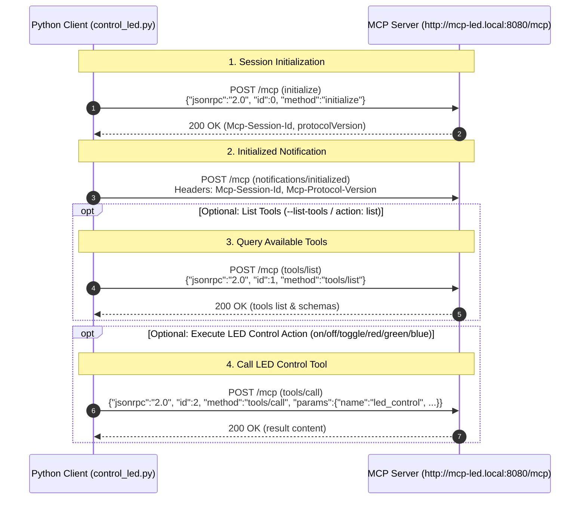

# LED Control Client (MCP)

[](https://opensource.org/licenses/MIT)
[](https://modelcontextprotocol.io/)

Python script to control an LED device using the **Model Context Protocol (MCP)** over HTTP/JSON-RPC.

## Features

- Communicates with MCP server over HTTP JSON-RPC 2.0.
- Supports turning the LED **on** / **off**, **toggling** state, and setting colors (**red**, **green**, **blue**).
- Supports querying available tools via `tools/list` using the `list` action or `--list-tools` (`-l`, `--list`) flag.
- Supports custom mDNS hostname and port parameters.
- Uses Python standard libraries (`urllib`, `json`) with no extra dependencies needed.

## Command Syntax

```bash
python control_led.py [action] [mdns] [port] [--list-tools]
```

### Arguments & Flags

| Argument / Flag | Required | Default | Description |
| --- | --- | --- | --- |
| `[action]` | No* | — | LED action: `on`, `off`, `toggle`, `red`, `green`, `blue`, `list` (*Required if `--list-tools` is not passed) |
| `[mdns]` | No | `mcp-led` | Hostname prefix for target device (`http://{mdns}.local:{port}/mcp`) |
| `[port]` | No | `8080` | Target server HTTP port |
| `--list-tools` / `-l` / `--list` | No | `false` | Optional flag to fetch and display available tools from the server via `tools/list` |

---

## Connection Sequence Diagram



---

## Usage Examples

### Listing Available Tools (`tools/list`)

```bash
# List tools using the 'list' action
python control_led.py list

# List tools using the optional flag
python control_led.py --list-tools

# List tools and then execute an action
python control_led.py on --list-tools
```

### Standard Commands (Default Host: `http://mcp-led.local:8080/mcp`)

```bash
# Turn LED ON
python control_led.py on

# Turn LED OFF
python control_led.py off

# Toggle LED state
python control_led.py toggle

# Set LED color to Red, Green, or Blue
python control_led.py red
python control_led.py green
python control_led.py blue
```

### Custom Server Hostname & Port

```bash
# Custom mDNS hostname (connects to http://my-custom-led.local:8080/mcp)
python control_led.py toggle my-custom-led

# Custom mDNS hostname and custom port (connects to http://my-custom-led.local:9090/mcp)
python control_led.py toggle my-custom-led 9090

# List tools on custom server
python control_led.py --list-tools my-custom-led 9090
```